# Curso Introductorio a Next.js 15 con App Router

¡Bienvenido/a al curso introductorio a Next.js 15 con App Router! Durante este curso, aprenderás los fundamentos (y no tanto) de Next.js con App Router para construir una aplicación web: [Restaurancy](https://restaurancy.goncy.dev), un catálogo de restaurantes.

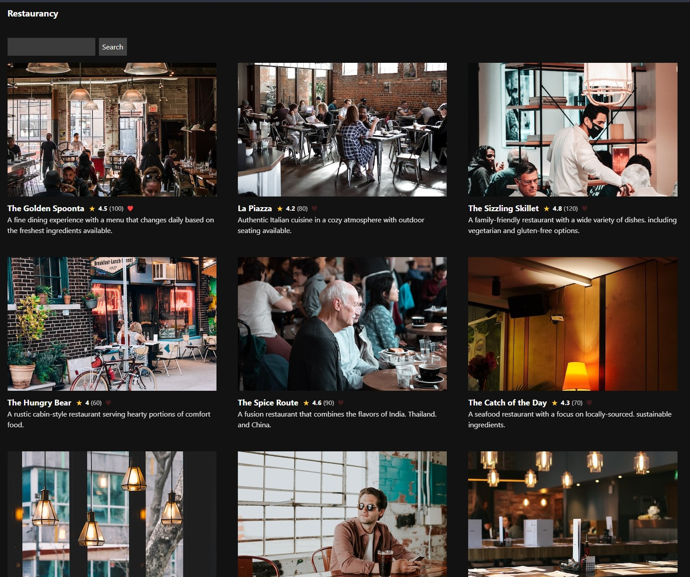

El diseño de este curso se plantea de manera incremental, donde cada lección se basa en la anterior. Te recomendamos seguir el orden de las lecciones para obtener el máximo beneficio.

Es natural que algunos conceptos puedan resultar complicados al principio o que no siempre sea evidente el motivo detrás de ciertas decisiones. No te preocupes, a medida que avances en el curso y te enfrentes a más ejercicios, así como a la creación de aplicaciones, estos conceptos irán cobrando mayor claridad y sentido. Ten en cuenta que hay diversas formas de lograr los mismos resultados, así que si tienes ideas diferentes, ¡adelante!

Si en algún momento sientes que el contenido del curso no es suficiente para abordar los ejercicios o comprender un tema en particular, no dudes en recurrir a la documentación oficial, ya sea de [Next.js](https://docs.nextjs.org/) o de [React](https://react.dev/reference/react).

## Video

Si prefieres seguir este curso en formato de video guiado, puedes verlo aquí:

[](https://youtu.be/s5jPwPZrJhw)

> [!WARNING]
> El video no está actualizado con el código de este repositorio. Pero sigue siendo válido para la mayoría de los temas.

## Requisitos

Asegúrate de cumplir con los siguientes requisitos antes de comenzar el curso:

- Conocimientos básicos de HTML, CSS y JavaScript.
  - Si no estás familiarizado con HTML, CSS y JavaScript, te recomendamos realizar la certificación de [Responsive Web Design](https://www.freecodecamp.org/learn/responsive-web-design) de freeCodeCamp.
- Conocimientos básicos de React.
  - En caso de no tener experiencia en React, te sugerimos completar [el curso oficial de React](https://es.react.dev/learn) o el de [React Foundations de Next.js](https://nextjs.org/learn/react-foundations).
- Tener Node.js instalado en tu computadora.
- Contar con un editor de código de tu preferencia.

> [!NOTE]
> Puedes optar por un entorno en línea, como [CodeSandbox](https://codesandbox.io), si no deseas o no puedes instalar nada en tu computadora.

## Terminología

A lo largo del curso, utilizaremos algunos términos que es importante que conozcas, aunque no necesariamente debes memorizar:

- **Routing (Enrutamiento):** Decide, basado en la URL, qué contenido mostrar al usuario.
- **Caching (Caché):** Espacio de almacenamiento temporal para guardar datos que se utilizarán en el futuro.
- **Rendering (Renderizado):** Proceso de convertir un componente en una representación visual.
- **Layout (Envoltorio):** Componente que envuelve a una (o varias) páginas.
- **Nested layout/pages/etc (Envoltorios/páginas/etc. anidados):** Por ejemplo, un layout que está dentro de otro layout.
- **Tree (Árbol):** Representación de una estructura jerárquica, componentes que contienen a otros.
- **Subtree (Subárbol):** Un árbol anidado dentro de otro árbol.
- **Leaf/Leaves (Hoja/Hojas):** Componente sin hijos.
- **URL segment (Segmento de URL):** Por ejemplo, en la URL `restaurancy.com/restaurante/goncy`, `restaurante` y `goncy` son segmentos de URL.
- **URL path (Ruta de URL):** Lo que sigue al dominio, como `/restaurante/goncy` en `restaurancy.com/restaurante/goncy`.
- **Build (Compilación):** Proceso de compilar el código y dejarlo listo para ser desplegado.
- **Bundle (Paquete):** Archivo que contiene parte o todo el código de la aplicación.
- **Boilerplate (Código base):** Porción de código repetitivo con poca variación.

## Tareas

Nuestro cliente Goncy es un reconocido chef de la ciudad de Quil-Mez, Francia. Con uno de los paladares más finos, visita todos los restaurantes en sus cercanías para puntuar su comida y atención. Para eso, nos contrató a desarrollar Restaurancy, un catálogo de los más finos restaurantes a sus alrededores. Nos dio plenas libertades en el diseño y librerías a usar, pero nos pidió que usemos Next.js y el App Router por que su hermano gemelo Argentino (también llamado Goncy), le dijo que no estaba mal. Algunas de las tareas que Goncy dejó en nuestro tablero son:

- Crear una ruta principal que muestre un listado de restaurantes, incluyendo su foto, nombre, descripción, puntaje y cantidad de valoraciones.
- Crear una ruta personalizada para cada restaurante que muestre la misma información que la ruta principal.
- Poder navegar entre las rutas libremente clickeando enlaces.
- Configurar nuestra aplicación para que sea correctamente indexada por motores de búsqueda.
- Al compartir el enlace de un restaurante por redes sociales, la previsualización del enlace debe contener la información del restaurante.
- Usar Google Sheets como base de datos.
- Revalidar los datos de los restaurantes cada 24 horas.
- Crear un endpoint utilitario que permita revalidar rutas on-demand.
- Crear una caja de búsqueda en nuestra ruta principal para poder buscar restaurantes por nombre.
- Poder compartir en enlace de la búsqueda para que otros usuarios puedan acceder directamente a nuestra búsqueda.
- Poder agregar y eliminar restaurantes de una lista de favoritos que se persiste en el dispositivo del usuario.

Opcionalmente también:
- Todas las páginas posibles deberían ser generadas de manera estática.
- En caso de acceder a una ruta no generada estáticamente deberíamos intentar renderizarla
- Mostrar estados de carga mientras obtenemos la información de rutas no generadas estáticamente.
- Mostrar una página de error si accedemos a una ruta errónea o hay un error en nuestra aplicación.

Goncy nos dijo que no tiene apuro para desarrollar esta aplicación así que puedes tomarte el tiempo que consideres necesario.

También nos dijo que te sientas libre de agregar las funcionalidades que consideres útiles para la aplicación y que seas todo lo creativo que quieras con el diseño.

## Índice

1. [¿Qué es Next.js?](#qué-es-nextjs)
2. [Creación de una Aplicación con Next.js](#creando-una-aplicación-con-nextjs)
    1. [Tecnologías en el Proyecto](#tecnologías-en-el-proyecto)
    2. [Estructura del Proyecto](#estructura-del-proyecto)
3. [Ambientes de Renderizado (Servidor y Cliente)](#ambientes-de-renderizado-servidor-y-cliente)
    1. [Server Components](#server-components)
    2. [Client Components](#client-components)
    3. [Cuándo Usar Server Components y Client Components](#cuándo-usar-server-components-y-client-components)
4. [Mostrando los Restaurantes](#mostrando-los-restaurantes)
5. [Mostrando un Restaurante](#mostrando-un-restaurante)
    1. [Router](#router)
    2. [Rutas Dinámicas](#rutas-dinámicas)
    3. [Colocación](#colocación)
6. [Navegación](#navegación)
7. [Metadatos](#metadatos)
    1. [Objeto `metadata`](#objeto-metadata)
    2. [`generateMetadata`](#generatemetadata)
    3. [Archivos de Metadatos](#archivos-de-metadatos)
8. [Estados de Carga](#estados-de-carga)
9. [Manejo de Errores](#manejo-de-errores)
10. [Uso de una Base de Datos](#usando-una-base-de-datos)
11. [Compilando Nuestra Aplicación](#compilando-nuestra-aplicación)
12. [Estrategias de Renderizado](#estrategias-de-renderizado)
    1. [Renderizado Estático](#renderizado-estático-por-defecto)
    2. [Renderizado Dinámico](#renderizado-dinámico)
    3. [Streaming](#streaming)
13. [Route Handlers](#route-handlers)
14. [Caching](#caching)
    1. [Configuraciones de Revalidación de Caché](#configuraciones-de-revalidación-de-caché)
        1. [cache: no-store](#cache-no-store)
        2. [revalidate: `<number>`](#revalidate-number)
        3. [Configuración de Segmento de Ruta](#configuración-de-segmento-de-ruta)
        4. [Funciones Dinámicas](#funciones-dinámicas)
    2. [Revalidación Manual](#revalidación-manual)
        1. [revalidatePath](#revalidatepath)
        2. [revalidateTag](#revalidatetag)
15. [Parámetros de URL](#parámetros-de-url)
16. [Agrupación de Rutas](#agrupado-de-rutas)
17. [Server Actions](#server-actions)
18. [Guardado en Favoritos (localStorage)](#guardar-en-favoritos-localstorage)
    1. [Pre-renderizado](#pre-renderizado)
    2. [Lazy Loading](#lazy-loading)
19. [El futuro de Next.js](#el-futuro-de-nextjs)
    1. [Dynamic IO](#dynamic-io)
        1. [`use cache`](#use-cache)
        2. [`cacheLife`](#cachelife)
        3. [`cacheTag`](#cachetag)

## ¿Qué es Next.js?

[Next.js](https://nextjs.org/) es un framework híbrido que opera tanto en el servidor como en el cliente, construido sobre React. Proporciona herramientas y funcionalidades que simplifican el desarrollo de aplicaciones web. Next.js se encarga de toda la configuración necesaria de React y sus herramientas para que nosotros podamos enfocarnos en desarrollar nuestra aplicación.

## Creando una Aplicación con Next.js

Para este proyecto vamos a usar un código base que se encuentra en la carpeta `code` de este repositorio. Para clonarlo a tu computadora vamos a ir a la terminal y ejecutar el siguiente comando:

```bash
npx degit goncy/nextjs-course/code restaurancy
```

Una vez completada la ejecución del comando, se generará una carpeta llamada `restaurancy` con todos los archivos necesarios para ejecutar la aplicación.

A continuación, ejecutemos los siguientes comandos:

```bash
cd restaurancy
npm install --force
npm run dev
```

> [!WARNING]
> Si usas `npm` el `--force` es necesario para que se instale correctamente ya que hay conflictos con las versiones de algunas dependencias de desarrollo.

Después de unos segundos, deberías ver un mensaje como este:

```bash
  ▲ Next.js <versión de Next.js>
  - Local:  http://localhost:3000
```

Si abres el navegador en la dirección `http://localhost:3000`, deberías visualizar una página de bienvenida similar a la siguiente:

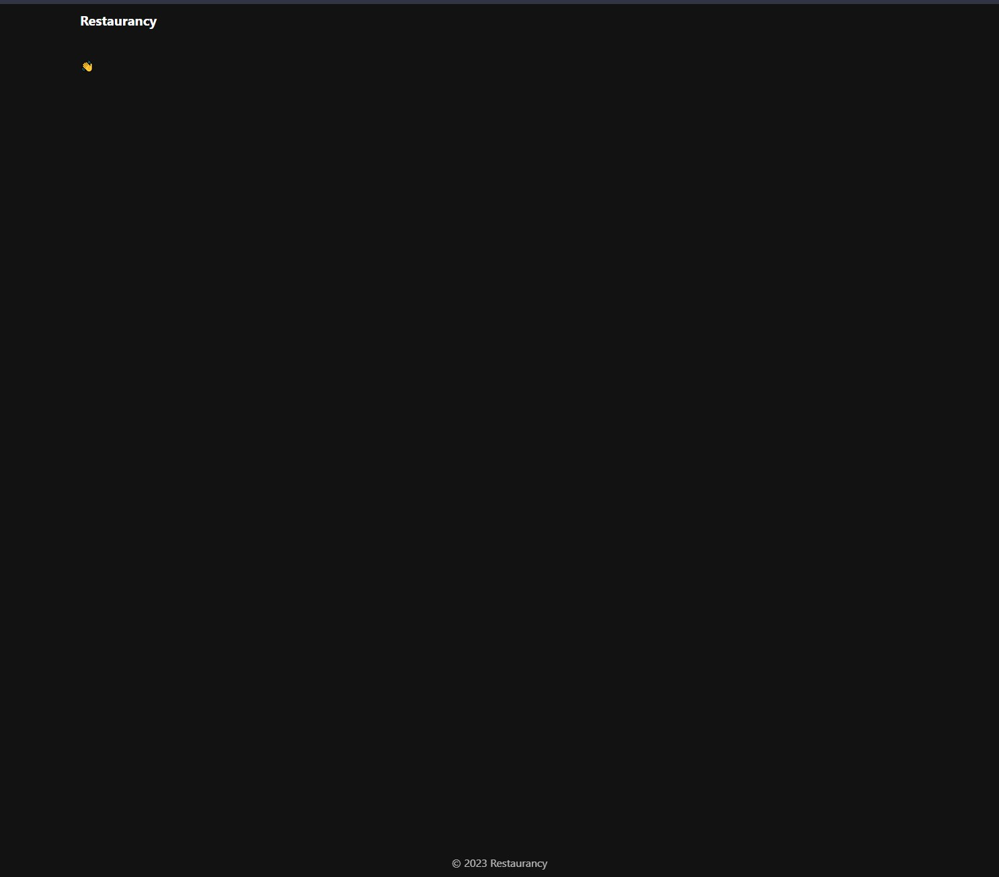

> [!TIP]
> Si quisieras crear un proyecto Next.js desde cero para otros proyectos, puedes usar el paquete [`create-next-app`](https://nextjs.org/docs/app/api-reference/cli/create-next-app).

### Tecnologías en el Proyecto

Además de Next.js y React, este proyecto utiliza [TypeScript](https://www.typescriptlang.org/) para añadir tipado y [Tailwind CSS](https://tailwindcss.com/) para gestionar estilos. No te preocupes si no estás familiarizado con TypeScript o Tailwind CSS; puedes optar por no escribir tipos en TypeScript y evitar el uso de las clases de Tailwind CSS, sustituyéndolas por el método que prefieras para manejar estilos.

### Estructura del Proyecto

En la raíz del proyecto, encontrarás varios archivos de configuración y otros elementos que podemos ignorar por el momento. Por ahora, nos centraremos en la carpeta `src` y su contenido.

```bash
└── src/
    ├── app/
    │   ├── favicon.ico
    │   ├── globals.css
    │   ├── layout.tsx
    │   └── page.tsx
    ├── api.ts
    └── types.ts
```

- `globals.css`: Este archivo contiene estilos globales para la aplicación, incluyendo los estilos de Tailwind CSS.
- `favicon.ico`: Icono predeterminado de la aplicación, visible en la pestaña del navegador.
- `layout.tsx`: Este archivo, específico de Next.js, nos permite definir un envoltorio para nuestra aplicación o página. En este caso, se encarga de establecer la estructura básica de la página (html y body), importar estilos globales, y agregar un encabezado, un pie de página y un contenedor para el contenido de la página. Recibe una prop `children`, que representa el contenido de la página que verá el usuario.
- `page.tsx`: Otro archivo especial de Next.js que nos permite definir una página. Dado que está en la raíz de nuestro directorio `app`, será la página que se mostrará al usuario al acceder al inicio (ruta `/`).
- `api.ts`: Este archivo define algunos métodos que utilizaremos a lo largo del curso para obtener información sobre restaurantes. Por ahora, solo devuelve datos de prueba, pero más adelante lo emplearemos para obtener datos reales.
- `types.ts`: Este archivo define una interfaz para los restaurantes, que usaremos para tipar los datos que obtenemos de la API.

Tómate un tiempo para modificar el contenido de estos archivos y observa cómo afecta a la aplicación. Mientras el servidor de desarrollo esté en ejecución, bastará con guardar un archivo para ver los cambios reflejados en la pantalla.

## Ambientes de Renderizado (Servidor y Cliente)

Existen [dos ambientes](https://nextjs.org/docs/app/building-your-application/rendering#rendering-environments) en los cuales las aplicaciones web con Next.js pueden renderizarse: el cliente y el servidor.


El término `cliente` hace referencia al navegador en el dispositivo del usuario, que envía una solicitud al `servidor` para recibir el código de tu aplicación y convertirlo en una interfaz visual para el usuario.

Por otro lado, el término `servidor` se refiere a una computadora en un centro de datos que almacena el código de tu aplicación y recibe solicitudes de los clientes, proporcionando respuestas a estas solicitudes. Todo lo que pasa en el servidor no es expuesto ni visible para el cliente, solamente lo que se retorna.

> [!NOTE]
> Mientras estamos en modo de desarrollo, corriendo `npm run dev`, el servidor es tu computadora.

Podemos visualizar esta transición como un flujo unidireccional desde el servidor hacia el cliente. Una vez que una solicitud se completa en el servidor y se transfiere al cliente, no puede regresar al servidor. Si se necesita volver al servidor, se realiza una nueva solicitud, por ejemplo, accediendo a una nueva ruta. La línea imaginaria que separa el servidor del cliente se conoce como `network boundary`.

Este concepto puede no resultar completamente claro en este momento, pero tomará mayor sentido a medida que adquiramos más práctica.

### Server Components

Por defecto, todos los componentes que usamos en la carpeta `app` (en App Router) son [React Server Components](https://nextjs.org/docs/app/building-your-application/rendering/server-components). Los Server Components son componentes de React que se ejecutan exclusivamente en el servidor. Estos componentes solo se ejecutan cuando el usuario accede a una ruta o segmento y no vuelven a ejecutarse en el cliente. Esto implica que no pueden manejar eventos del usuario, estados locales ni hooks, pero pueden acceder directamente a datos del servidor, bases de datos, variables de entorno privadas y todo lo que se pueda hacer en el servidor.

Sin embargo, una aplicación típica también está compuesta por componentes dinámicos e interactivos que requieren interacciones del usuario, eventos y más. Para estos casos, podemos usar `Client Components`. Los Server Components pueden importar y usar Client Components, pero los Client Components no pueden importar Server Components. No te preocupes si esto aún no tiene mucho sentido; veremos cómo funciona más adelante.

Podemos utilizar Server Components dentro de otros Server Components de manera indefinida, pero, en el momento en que usamos un Client Component, marcamos nuestro `network boundary`.

Si intentamos usar un hook o suscribirnos a un evento en un Server Component, obtendremos un error.

```jsx
import { useState } from 'react' // 🚨 ReactServerComponentsError 🚨: Estás importando un componente que necesita useState. Solo funciona en un Client Component, pero ninguno de sus padres está marcado con "use client", por lo que son Server Components por defecto.

export default function Page() {
  return (...)
}
```

Ahora, la pregunta clave es: ¿por qué renderizaríamos algo en el servidor? Bueno, aquí hay una lista de beneficios al ejecutar tareas en el servidor:
- Obtención de datos: Podemos obtener nuestros datos desde un servidor más cercano a nuestra fuente de datos, lo que hace que la obtención sea más rápida y eficiente.
- Seguridad: Al ejecutarse desde el servidor, podemos mantener toda la información sensible, como tokens, credenciales y más, oculta al usuario.
- Tamaño del bundle: Muchas tareas que antes debíamos realizar en el cliente ahora las podemos hacer en el servidor, minimizando la cantidad de código que debemos enviar al cliente.
- Pintado inicial: En el servidor, podemos generar HTML y CSS que se envían al cliente de inmediato, sin necesidad de esperar a que se descargue y ejecute JavaScript en el cliente.
- SEO: El HTML renderizado por el servidor puede ser utilizado por los motores de búsqueda para indexar nuestra aplicación.
- Streaming: Podemos enviar contenido al cliente a medida que se va generando, en lugar de esperar a que se genere todo el contenido para enviarlo al cliente. Esto permite al usuario ver el contenido más rápido.

### Client Components

Los `Client Components` nos permiten escribir interfaces interactivas y dinámicas que se ejecutan en el cliente. Los Client Components pueden usar hooks, estados locales, eventos, APIs del navegador y más. Podemos pensar en los Client Components como "los componentes habituales que usamos en React en nuestras aplicaciones con Vite o Create React App". Aunque con algunas diferencias, como que se renderizan una vez en el servidor antes de renderizarse en el cliente.

> [!NOTE]
> Puedes leer más acerca de los client components y como son renderizados [aquí](https://nextjs.org/docs/app/building-your-application/rendering/client-components#how-are-client-components-rendered)

Para marcar un componente como Client Component, debemos agregar la directiva `"use client"` al inicio del archivo.

```jsx
'use client'

import { useState } from 'react'

export default function Counter() {
  const [count, setCount] = useState(0);

  return (
    <div>
      <p>You clicked {count} times</p>
      <button onClick={() => setCount(count + 1)}>Click me</button>
    </div>
  )
}
```

### Cuándo Usar Server Components y Client Components

Aunque hay excepciones para cada uno, esta lista resume cuándo deberías usar cada uno la mayoría de las veces.

| ¿Qué debes hacer?                                                                                     | Componente del Servidor | Componente del Cliente |
|-------------------------------------------------------------------------------------------------------|-------------------------|------------------------|
| Acceder a recursos del backend (directamente)                                                         | ✅                      | ⛔                     |
| Manejar información sensible (tokens de acceso, claves API, etc.)                                     | ✅                      | ⛔                     |
| Manejar dependencias grandes / Reducir JavaScript del lado del cliente                                | ✅                      | ⛔                     |
| Obtener datos                                                                                         | ✅                      | ⌚                     |
| Agregar interactividad y escuchadores de eventos (`onClick`, `onChange`, etc.)                        | ⛔                      | ✅                     |
| Utilizar Estado y Efectos del Ciclo de Vida (`useState`, `useReducer`, `useEffect`, etc.)             | ⛔                      | ✅                     |
| Utilizar APIs exclusivas del navegador                                                                | ⛔                      | ✅                     |
| Utilizar hooks personalizados que dependen del estado, efectos o APIs exclusivas del navegador        | ⛔                      | ✅                     |
| Utilizar [Componentes de Clase de React](https://react.dev/reference/react/Component)                 | ⛔                      | ✅                     |

> [!NOTE]
> No está mal obtener datos desde un Client Component, pero si podemos hacerlo del servidor y optimizarlo, mejor. Optamos por obtener datos desde el cliente cuando: hay interacciones del usuario que tienen que actualizar una porción de los datos, hacer polling o cuando toda nuestra página es estática excepto por un dato entonces la mantenemos estática y obtenemos ese dato desde el cliente.

## Mostrando los Restaurantes

Ahora que ya tenemos un poco de teoría, vamos a ver realmente como usar Server Components en nuestra aplicación. En `api.ts`, encontraremos un objeto `api` con un método `list` que devuelve una `Promise` con un array de `Restaurant`. Veamos cómo podemos utilizar este método en nuestro Server Component `page.tsx`:

```jsx
import api from "@/api";

export default async function Home() {
  const restaurants = await api.list();

  console.log(restaurants);

  return (...);
}
```

Al observar la consola (no la del navegador, sino la terminal donde ejecutamos `npm run dev`), veremos un listado de `Restaurant`. ¿Cómo es posible esto? 🤯 Como mencionamos anteriormente, los Server Components no se vuelven a renderizar. Por lo tanto, podemos convertir nuestro componente en una función asíncrona y esperar a que la `Promise` se resuelva con los datos de los restaurantes. Luego, utilizamos esos datos para renderizarlos en nuestra página.

Iteremos sobre `restaurants` para crear una grilla que muestre la imagen, el título, la descripción y el rating de cada restaurante.

```jsx
import api from "@/api";

export default async function Home() {
  const restaurants = await api.list();

  return (
    <section className="grid grid-cols-1 gap-12 md:grid-cols-2 lg:grid-cols-3">
      {restaurants.map((restaurant) => {
        return (
          <article key={restaurant.id}>
            
            <h2 className="inline-flex gap-2 text-lg font-bold">
              <span>{restaurant.name}</span>
              <small className="inline-flex gap-1">
                <span>⭐</span>
                <span>{restaurant.score}</span>
                <span className="font-normal opacity-75">({restaurant.ratings})</span>
              </small>
            </h2>
            <p className="opacity-90">{restaurant.description}</p>
          </article>
        );
      })}
    </section>
  );
}
```

El resultado es el siguiente:
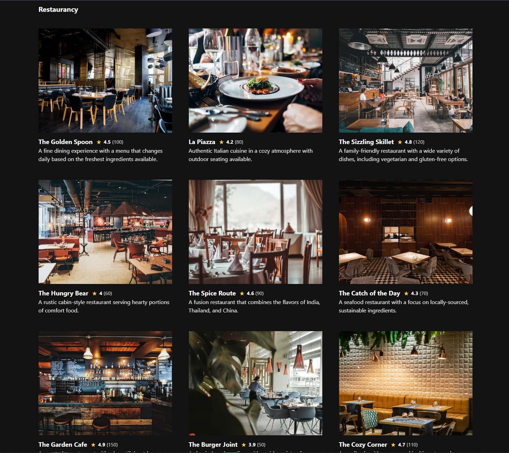

En resumen, hemos aprendido que, además de ejecutarse en el servidor y aprovechar todos los beneficios mencionados anteriormente, los Server Components pueden utilizar `async/await`. Esto nos ayuda a reducir el boilerplate y la complejidad de nuestra aplicación al obtener datos de manera eficiente.

**Bonus:** Personaliza la grilla de restaurantes con tu propio toque mágico de estilos. ¡Diviértete explorando y mejorando la presentación visual!

## Mostrando un Restaurante

Vamos a crear una ruta para visualizar cada restaurante de manera individual. Antes de sumergirnos en el código, echemos un vistazo al funcionamiento del router de Next.js y comprendamos algunas de sus convenciones de archivos.

### Router

Next.js, con App Router, utiliza un router construido sobre React Server Components que soporta layouts compartidos, enrutamiento anidado, manejo de estados de carga, manejo de errores y más. El enrutamiento de App Router se basa en archivos, lo que significa que podemos crear rutas y segmentos simplemente creando archivos y carpetas. Entonces, ¿qué archivos y carpetas debemos crear? Ya conocemos `layout.tsx` y `page.tsx`, pero ¿cómo podemos usarlos para crear otras cosas? Veamos algunas convenciones que vamos a utilizar en este curso:

- `layout.tsx`: Envuelve a `page.tsx`, permitiendo compartir un layout entre varias páginas.
- `page.tsx`: Define una página, recibe parámetros y parámetros de búsqueda como props.
- `loading.tsx`: Página de carga que se muestra mientras la ruta se está cargando; cuando la carga termina, se reemplaza la pantalla de carga por la respuesta de `page.tsx`.
- `error.tsx`: Página de error que se muestra al haber una excepción o error en la ejecución de una página o layout.
- `route.tsx`: Define una ruta de API, se ejecuta en el servidor y devuelve datos usando un objeto `Response`.

Eso debería ser suficiente por ahora en cuanto a archivos (puedes ver más [aquí](https://nextjs.org/docs/app/building-your-application/routing#file-conventions)).

### Rutas Dinámicas
Hemos hablado de archivos, pero también mencionamos carpetas y su anidación. ¿Cómo creamos una ruta para mostrar un restaurante basado en su `id`? La estructura de carpetas y archivos se vería así:

```bash
└── src/
    ├── app/
    │   ├── favicon.ico
    │   ├── globals.css
    │   ├── layout.tsx
    │   ├── page.tsx
    │   └── [id]/
    │       └── page.tsx
    ├── api.ts
    └── types.ts
```

Ahora, creemos la carpeta y el archivo `src/app/[id]/page.tsx` y añadamos el siguiente contenido:

```jsx
import api from "@/api";

export default async function RestaurantPage({params}: {params: Promise<{id: string}>}) {
  const {id} = await params;
  const restaurant = await api.fetch(id);

  return (
    <article key={restaurant.id}>
      
      <h2 className="inline-flex gap-2 text-lg font-bold">
        <span>{restaurant.name}</span>
        <small className="inline-flex gap-1">
          <span>⭐</span>
          <span>{restaurant.score}</span>
          <span className="font-normal opacity-75">({restaurant.ratings})</span>
        </small>
      </h2>
      <p className="opacity-90">{restaurant.description}</p>
    </article>
  );
}
```

Al ingresar a la ruta `/1`, deberíamos ver algo así:
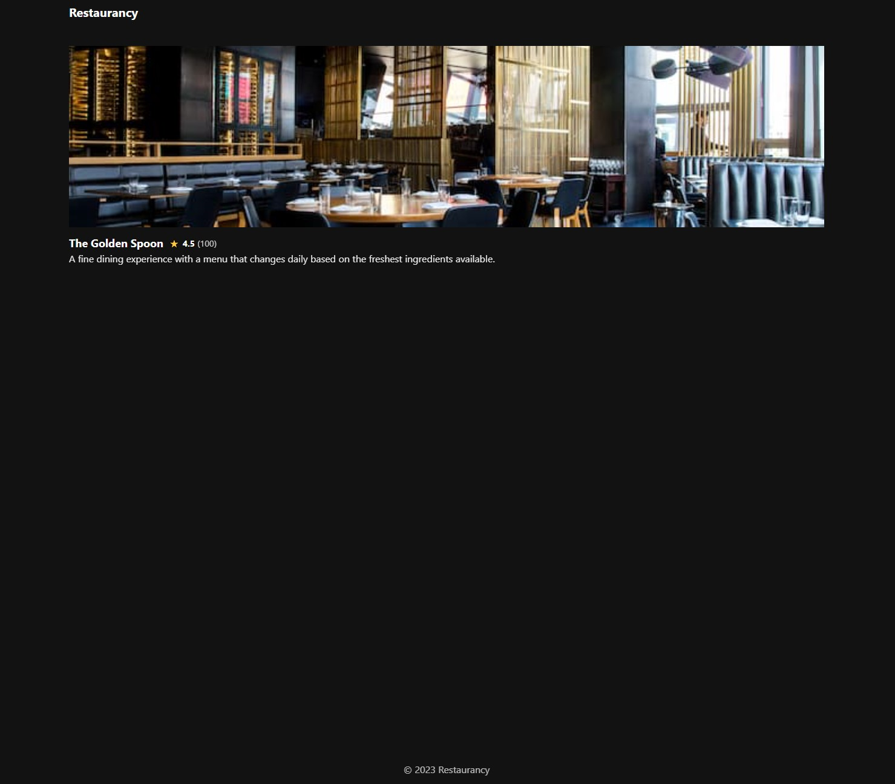

Veamos cómo sucedió esto. Recordamos que los componentes, por defecto son Server Components, así que hicimos que sea `async` y utilizamos nuestro método `api.fetch` para obtener los datos del restaurante. Además, aprendimos algo nuevo: el archivo `page.tsx` recibe como props una propiedad `params` que contiene los parámetros de la ruta. En este caso, como nuestra ruta es `/[id]`, el parámetro se llama `id`. [Desestructuramos](https://es.javascript.info/destructuring-assignment#desestructuracion-de-objetos) `params` para obtener el `id` y lo usamos para obtener los datos del restaurante y renderizarlos en la página.

Ahora tenemos un pequeño problema: acabamos de repetir todo el código de la tarjeta del restaurante.

> [!IMPORTANT]
> Crea un componente `RestaurantCard` para la tarjeta del restaurante y reutilizalo en `page.tsx` y `[id]/page.tsx`.

Pero... ¿Dónde deberían ir los componentes que no son páginas, layouts o archivos especiales?

### Colocación

Aunque el router de Next.js se basa en archivos, solo los archivos con nombres especiales se convierten en rutas de nuestra aplicación. Por lo tanto, podríamos crear una carpeta `components` dentro de `app` (o anidada donde la necesitemos) sin ningún problema.


Ahora sí, ve y crea ese componente. Luego, reutilízalo en `page.tsx` y `[id]/page.tsx`.

## Navegación

En Next.js, tenemos el componente `Link` que nos permite navegar entre páginas de nuestra aplicación. Se usa de manera muy similar a la etiqueta `<a>` y lo podemos importar desde `next/link`. Agreguemos a nuestra grilla de restaurantes un enlace para poder navegar a la página de cada restaurante.

```jsx
import Link from "next/link";

import api from "@/api";

export default async function Home() {
  const restaurants = await api.list();

  return (
    <section className="grid grid-cols-1 gap-12 md:grid-cols-2 lg:grid-cols-3">
      {restaurants.map((restaurant) => {
        return (
            ...
              <Link href={`/${restaurant.id}`} key={restaurant.id}>
                <RestaurantCard restaurant={restaurant} />
              </Link>
            ...
        );
      })}
    </section>
  );
}
```

> [!IMPORTANT]
> Agrega a la página de detalle del restaurante un enlace para volver a la página de inicio y otro enlace al encabezado en el layout para que, al hacer clic en el logo, nos lleve al inicio.

## Metadatos

Los metadatos son información adicional para indicarle al navegador y motores de búsqueda, el contenido de nuestra página. Juega un rol crucial en el SEO (Search Engine Optimization) y en la accesibilidad. En Next.js podemos definir metadatos mediante configuración o mediante archivos.

### Objeto `metadata`

Podemos definir y exportar una constante `metadata` en `layout.tsx` o en `page.tsx` para definir metadatos estáticos. En `layout.tsx` modifiquemos la propiedad `title` del objeto `metadata` para que se vea así:

```jsx
export const metadata: Metadata = {
  title: 'Restaurancy - Hello World',
  description: 'The best restaurants in the world',
  keywords: ['restaurant', 'food', 'eat', 'dinner', 'lunch'],
}
```

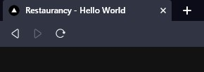

Ahora deberíamos ver el título de nuestra página actualizado.

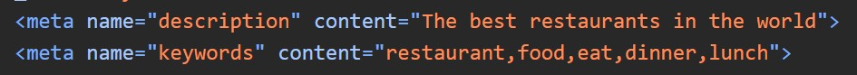

Si abrimos las herramientas de desarrollo veremos que dentro del tag `head` podemos ver los metadatos que definimos.

> [!NOTE]
> Puedes encontrar más información sobre las propiedades disponibles en el `metadata object` [aqui](https://nextjs.org/docs/app/api-reference/functions/generate-metadata#metadata-object).

### `generateMetadata`

Si necesitamos información de la petición para generar metadatos (por ejemplo el nombre de un restaurante) podemos usar la función `generateMetadata` y retornar un objeto con todos los metadatos de nuestra página. En `src/app/[id]/page.tsx` creemos una función `generateMetadata` de la siguiente manera:

```ts
export async function generateMetadata({params}: {params: Promise<{id: string}>}) {
  const {id} = await params;
  const restaurant = await api.fetch(id);

  return {
    title: `${restaurant.name} - Restaurancy`,
    description: restaurant.description,
  };
}
```

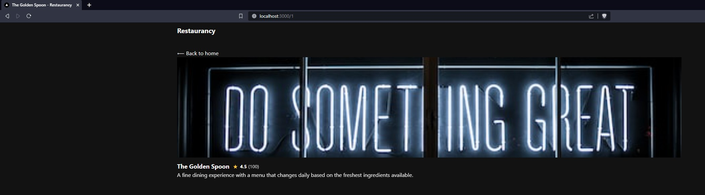

Al ingresar a alguno de nuestros restaurantes veremos el título de la página actualizado.

### Archivos de metadatos

Podemos crear [archivos especiales de metadatos](https://nextjs.org/docs/app/api-reference/file-conventions/metadata) dentro de `src/app` o dentro de nuestras rutas. Los archivos de metadatos pueden ser archivos estáticos (como `.jpg`, `.png`, `.txt`) o pueden ser archivos dinámicos (como `.tsx`). Esta última nos permite generar metadatos, como [imágenes de Open Graph personalizadas basadas en información de la petición](https://nextjs.org/docs/app/api-reference/file-conventions/metadata/opengraph-image).

> [!IMPORTANT]
> Define algunos metadatos a nivel aplicación, como title, description, keywords, etc. Y muestra una imagen de Open Graph personalizada en la página de detalle de cada restaurante.

## Estados de Carga

Nuestras páginas cargan bastante rápido (estamos simulando una demora de 750 ms). Vamos a `api.ts` y cambiemos ese `750` por `7500`. Si recargamos, veremos que la página tarda 7.5 segundos en cargar. El problema es que mientras la página carga, el usuario no ve nada y no sabe si la página funciona o no, si su internet anda mal o qué está pasando.

En Next.js, podemos definir un archivo `loading.tsx`, el cual está construido sobre [React Suspense](https://react.dev/reference/react/Suspense). Mientras nuestra página esté suspendida (mientras haya operaciones bloqueantes como una petición en curso en un Server Component), se mostrará el contenido de `loading.tsx`. Una vez que esas operaciones terminen, se reemplazará el contenido de `loading.tsx` por el contenido de `page.tsx`. Esto nos permite no solo mostrarle al usuario que "algo está cargando", sino que también nos permite enviar todas las partes de nuestra aplicación que no dependan de esas operaciones bloqueantes, como el header, footer o los componentes que ya terminaron sus operaciones.

Creemos el archivo `src/app/loading.tsx` y agreguemos el siguiente contenido:

```jsx
export default function Loading() {
  return (
    <div>Loading...</div>
  );
}
```

Ahora, al recargar la página, veremos que mientras se está cargando, se muestra el texto "Loading..." y una vez que termina de cargar, se reemplaza por el contenido de `page.tsx`.

Pero también notamos que si vamos a la ruta `/1`, también se muestra el texto "Loading...". ¿Por qué? Si el `loading.tsx` está definido en la raíz de nuestro proyecto.

Cuando una parte de nuestra aplicación se suspende, busca hacia arriba el Suspense Boundary más cercano y lo utiliza. En este caso, al no haber ninguno en `/[id]`, sube y encuentra el definido en la raíz de nuestra aplicación.

> [!NOTE]
> Si quisiéramos, podríamos definir un nuevo `loading.tsx` dentro de `[id]` y se usaría ese en vez del de la raíz, pero por ahora estamos bien con este.

## Manejo de Errores

De momento, nuestra aplicación usa datos de prueba, por lo que es poco probable que ocurran errores. Sin embargo, puede ser que alguien intente acceder a una página que no existe o que simplemente queramos estar preparados para el día de mañana.

Creemos el archivo `src/app/error.tsx` y agreguemos el siguiente contenido:

```jsx
'use client'

export default function ErrorPage({ error }: { error: Error }) {
  console.error(error);

  return (
    <div>Something went wrong, try again!</div>
  );
}
```

Si intentamos entrar a una ruta inexistente, como `/123`, veremos una ventana de error (en desarrollo) y el contenido de nuestra página de error correctamente. Un detalle es que el archivo `error.tsx` siempre debe ser un Client Component, ya que recibe por props, una función `reset` a la que podemos llamar para re-renderizar nuestra página.

El archivo `error.tsx` funciona con un React Error Boundary cuyo comportamiento es similar al Suspense Boundary, buscando hacia arriba el Error Boundary más cercano. Por ende, si algo falla en `/1` o en `/`, se usará el mismo `error.tsx`.

> [!NOTE]
> Si no definimos un archivo `error.tsx`, se usará el que viene por defecto en Next.js.

## Usando una Base de Datos

Vamos a trasladar nuestros datos de prueba a una base de datos para poder modificarlos cuando queramos. En este caso, usaremos Google Sheets, ya que es fácil, gratuito y no requiere configuración. Si no te gusta, puedes usar la base de datos que prefieras. Para ello, accedamos a [https://sheets.new](https://sheets.new) y creemos una nueva hoja con los mismos datos que nuestros datos de prueba.

Puedes utilizar ChatGPT para convertir los datos de prueba. De todos modos, aquí tienes los datos (cópialos, pégalo en la primera celda de Google Sheets y selecciona del Menu: `Datos > dividir texto en columnas`):

```csv
id,name,description,address,score,ratings,image
1,The Golden Spoon,"A fine dining experience with a menu that changes daily based on the freshest ingredients available.",123 Main St. Anytown USA,4.5,100,https://picsum.photos/id/30/480/300
2,La Piazza,"Authentic Italian cuisine in a cozy atmosphere with outdoor seating available.",456 Oak Ave. Anytown USA,4.2,80,https://picsum.photos/id/42/480/300
3,The Sizzling Skillet,"A family-friendly restaurant with a wide variety of dishes. including vegetarian and gluten-free options.",789 Elm St. Anytown USA,4.8,120,https://picsum.photos/id/163/480/300
4,The Hungry Bear,"A rustic cabin-style restaurant serving hearty portions of comfort food.",101 Forest Rd. Anytown USA,4.0,60,https://picsum.photos/id/192/480/300
5,The Spice Route,"A fusion restaurant that combines the flavors of India. Thailand. and China.",246 Main St. Anytown USA,4.6,90,https://picsum.photos/id/195/480/300
6,The Catch of the Day,"A seafood restaurant with a focus on locally-sourced. sustainable ingredients.",369 Beach Blvd. Anytown USA,4.3,70,https://picsum.photos/id/225/480/300
7,The Garden Cafe,"A vegetarian restaurant with a beautiful outdoor garden seating area.",753 Maple St. Anytown USA,4.9,150,https://picsum.photos/id/292/480/300
8,The Burger Joint,"A classic American diner with a wide variety of burgers. fries. and milkshakes.",852 Oak Ave. Anytown USA,3.9,50,https://picsum.photos/id/326/480/300
9,The Cozy Corner,"A small cafe with a warm and inviting atmosphere. serving breakfast and lunch dishes.",963 Main St. Anytown USA,4.7,110,https://picsum.photos/id/365/480/300
10,The Steakhouse,"A high-end restaurant specializing in premium cuts of beef and fine wines.",1479 Elm St. Anytown USA,4.1,75,https://picsum.photos/id/395/480/300
11,The Taco Truck,"A casual Mexican restaurant serving authentic street tacos.",753 Main St. Anytown USA,4.4,65,https://picsum.photos/id/429/480/300
12,The Ice Cream Parlor,"A family-friendly restaurant with a wide variety of ice cream flavors.",852 Oak Ave. Anytown USA,4.9,150,https://picsum.photos/id/431/480/300
```

Luego, para acceder a esta data desde nuestra app, vayamos a `Archivo > Compartir > Publicar en la web`, publiquemos y copiemos el enlace que nos da para acceder a la data en formato `.csv`.

> [!TIP]
> Si sabes que los campos contienen `,` en sus columnas, podrías usar el formato `.tsv` en vez de `.csv`, ya que usa `\t` en vez de `,` como separador, lo cual es menos frecuente.

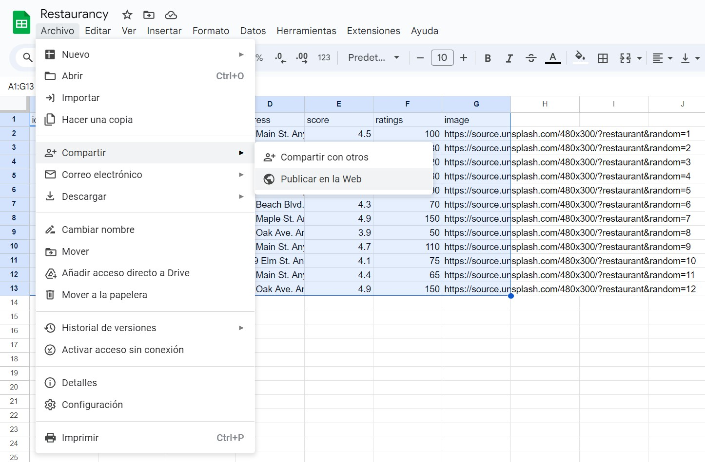


Una vez que tengamos el enlace, vayamos a nuestro `api.ts` y cambiemos nuestro método `list` para que use la data de Google Sheets.

```ts
const api = {
  list: async (): Promise<Restaurant[]> => {
    // Obtenemos la información de Google Sheets en formato texto y la dividimos por líneas, nos saltamos la primera línea porque es el encabezado
    const [, ...data] = await fetch('...').then(res => res.text()).then(text => text.split('\n'))

    // Convertimos cada línea en un objeto Restaurant, asegúrate de que los campos no posean `,`
    const restaurants: Restaurant[] = data.map((row) => {
      const [id, name, description, address, score, ratings, image] = row.split(',')
      return {
        id,
        name,
        description,
        address,
        score: Number(score),
        ratings: Number(ratings),
        image
      }
    })

    // Lo retornamos
    return restaurants;
  },
  ...
}
```

¡Listo! Ahora, al recargar la página, deberíamos ver los datos de Google Sheets. Toma en cuenta que Google Sheets podría tardar unos segundos en reflejar los cambios, así que si no ves los datos actualizados, prueba con <kbd>ctrl</kbd> + <kbd>shift</kbd> + <kbd>R</kbd> (<kbd>cmd</kbd> + <kbd>shift</kbd> + <kbd>R</kbd> si usas Mac).

> [!IMPORTANT]
> Asegurarte de que el método `fetch` funcione correctamente en la ruta `/[id]`.

## Compilando Nuestra Aplicación

Ahora que tenemos una aplicación más o menos completa, vamos a compilarla y ejecutarla localmente para ver más acertadamente qué tan bien funcionaría en un entorno productivo. Para ello, terminemos el comando de nuestro servidor (<kbd>ctrl</kbd> + <kbd>c</kbd> o <kbd>cmd</kbd> + <kbd>c</kbd> en Mac) de desarrollo y ejecutemos los siguientes comandos:

```bash
npm run build
npm start
```

Después de unos segundos, veremos algo como esto:

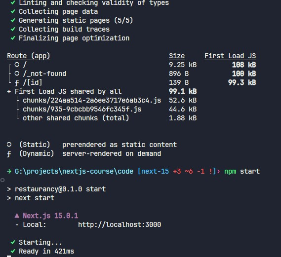

Si vamos a `http://localhost:3000`, deberíamos ver nuestra aplicación funcionando. ¡Y funciona! Pero... Si vamos a la ruta `/`, no se muestra el componente de carga. Todo funciona, como por arte de magia, pero ¿por qué? Antes, intentemos algo. Vayamos a nuestra hoja de Google Sheets, actualicemos un título, volvamos a nuestra app y recarguemos con <kbd>ctrl</kbd> + <kbd>f5</kbd>.

Mmm... No funciona.

Veamos de nuevo la imagen de más arriba:


Podemos ver que la ruta de `/` tiene un ícono de `○` (abajo nos dice que significa estático), mientras que nuestra ruta de `/[id]` tiene un ícono de `ƒ` (abajo nos dice que significa `Dynamic`).

## Estrategias de Renderizado

En Next.js, existen tres estrategias principales de renderizado: estática, dinámica y streaming.

### Renderizado estático (por defecto)

Con el renderizado estático, nuestras rutas se renderizan en tiempo de compilación. Esto permite que los datos estén disponibles desde la primera visita de un usuario. Estos datos se persisten a lo largo del tiempo, y las siguientes visitas de un usuario no impactarán nuestro origen de datos. Esto nos permite tener una aplicación con un tiempo de carga muy rápido y un bajo consumo de recursos.

El renderizado estático es muy útil para páginas que no cambian con frecuencia o no incluyen información proveniente de la petición.

Nuestra ruta `/` tuvo un renderizado estático por defecto, pero ¿por qué nuestra ruta de `/[id]` no? Bueno, porque Next.js no sabe cuáles son los `id` de nuestros restaurantes, por lo tanto, no puede renderizarlos en tiempo de compilación. Sin embargo, si en nuestra página `/[id]/page.tsx` definimos una función [`generateStaticParams`](https://nextjs.org/docs/app/api-reference/functions/generate-static-params) que devuelva los ids que queremos generar, generará esos ids en tiempo de compilación de manera estática:

```jsx
export async function generateStaticParams() {
  const restaurants = await api.list();
 
  return restaurants.map((restaurant) => ({
    id: restaurant.id,
  }));
}
```

> [!TIP]
> También podemos exportar una variable `dynamicParams` como `false` en nuestra página si queremos que devuelva un 404 para cualquier ruta no definida en `generateStaticParams`.

### Renderizado dinámico

Con el renderizado dinámico, nuestras rutas se renderizan cada vez que un usuario ingresa a ellas. El renderizado dinámico es útil cuando una ruta debe usar información proveniente de la petición (como cookies, headers, search params, etc.) o cuando la información cambia con mucha frecuencia.

Para optar por una ruta con renderizado dinámico, podemos establecer configuraciones de caché a nivel de `fetch`, ruta/segmento o al usar funciones dinámicas. Hablaremos de esto en la próxima sección.

### Streaming

El Streaming es una técnica de transferencia de datos que nos permite dividir el contenido en trozos más pequeños y enviarlos al cliente a medida que esten disponibles. Esto evita que procesos bloqueantes (como obtener datos) eviten que el usuario no vea nada hasta que todo esté disponible.

Para habilitar streaming basta con tener un Suspense Boundary, definiendo un archivo `loading.tsx` o montando un componente Suspense manualmente en algun Server Component. Ahora nuestra ruta está dividida en partes, cada vez que un Suspense Boundary superior termine de procesar, enviará su contenido al usuario, permitiendo que el usuario vea el contenido a medida que esté disponible.

> [!NOTE]
> Ya usamos los 3 métodos de renderizado. Estático: Nuestra página de inicio, dinámico: Nuestra página de detalle antes de agregar el `loading.tsx`, streaming: Nuestra página de detalle luego de agregar el `loading.tsx` y antes de agregar el `generateStaticParams`.

**Pregunta**: ¿Que tipo de renderizado estamos usando en nuestra página de inicio y en la de detalle ahora?

## Route Handlers

Habremos escuchado el stack MERN (MongoDB, Express, React, Node.js) u otros similares. Si pensamos en Next.js: Tenemos un servidor Node.js que puede consumir datos de una DB y retornar una UI usando componentes de React. Pero, que podemos hacer si necesitamos un endpoint, un `/api/restaurants` por ejemplo, para consumir datos desde una aplicación mobile?

Tenemos los [Route Handlers](https://nextjs.org/docs/app/building-your-application/routing/route-handlers) disponibles mediante el uso del archivo especial `route.ts`. Podemos exportar funciones con los nombres de los métodos HTTP habituales, y se ejecutarán cuando la ruta reciba una petición del mismo método. Por ejemplo, si creamos un archivo `src/app/api/restaurants/route.ts` con el siguiente contenido:

```ts
import type {NextRequest} from "next/server";

import {api} from "@/api";

export async function GET(request: NextRequest) {
  const restaurants = await api.list();

  return Response.json(restaurants);
}
```

De esta manera, cuando hagamos una petición `GET` a `/api/restaurants`, se ejecutará la función `GET` y retornará el listado de restaurantes.

> [!TIP]
> Podemos exportar múltiples funciones en el mismo archivo y se ejecutarán según el método de la petición.

## Caching

Cuando trabajamos con aplicaciones React en Vite, Create React App o similares, generalmente lidiamos con un solo caché, el caché del navegador. En Next.js, tenemos muchos tipos de caché diferentes:


| Mecanismo                    | Qué                             | Dónde    | Propósito                                                  | Duración                                    |
| ---------------------------- | ------------------------------- | -------- | ---------------------------------------------------------- | ------------------------------------------- |
| Memorización de Solicitudes  | Valores de retorno de funciones | Servidor | Reutilizar datos en un árbol de componentes React          | Duración de la solicitud                    |
| Caché de Datos               | Datos                           | Servidor | Almacenar datos entre solicitudes de usuario y despliegues | Persistente (puede ser revalidado)          |
| Caché de Ruta Completa       | HTML y carga RSC                | Servidor | Reducir el costo de renderización y mejorar el rendimiento | Persistente (puede ser revalidado)          |
| Caché de Enrutamiento        | Carga RSC                       | Cliente  | Reducir las solicitudes al servidor durante la navegación  | Sesión de usuario o basado en el tiempo     |

Next.js, por defecto, intentará cachear tanto como sea posible para mejorar el rendimiento y reducir los costos. Cuando tenemos un segmento dinámico pero una petición de datos todavía tiene caché relevante, en lugar de ir al origen, Next.js intentará obtenerlo desde el caché de datos. A continuación, podemos ver un diagrama de cómo funcionan los diferentes tipos de caché.


El comportamiento del caché dependerá de si tu ruta tiene renderizado estático o dinámico, si los datos están en caché o no, o si una solicitud es parte de una visita inicial o una navegación subsecuente. Esto puede parecer un poco abrumador, pero con el tiempo y la práctica, veremos que los beneficios son muchos.

> [!NOTE]
> Saber esto sobre el caching ayuda a entender cómo funciona Next.js, pero no es contenido esencial para ser productivo en Next.js.

### Configuraciones de Revalidación de Caché

No siempre queremos contenido 100% estático o 100% dinámico, por eso tenemos varias maneras de estipular cómo queremos que se maneje el caché.

#### `cache: "force-cache"` (por defecto)

Si vemos el método `list` en nuestro `api.ts`, vemos que tiene la propiedad `cache` definida como `force-cache`. Esto le indica a Next.js que cada vez que una ruta deba obtener los datos de `list`, use la caché de datos.

```ts
const [, ...data] = await fetch('...', { cache: 'force-cache' }).then(res => res.text()).then(text => text.split('\n'))
```

#### `cache: "no-store"`

Reemplaza la propiedad `cache: 'force-cache'` por `cache: 'no-store'` en nuestro `api.ts` para que el método `list` no use la caché de datos.

```ts
const [, ...data] = await fetch('...', { cache: 'no-store' }).then(res => res.text()).then(text => text.split('\n'))
```

Esto le indicará a Next.js que cada vez que una ruta deba obtener los datos de `list`, no debe usar la caché de datos. Para probar si funcionó, detén el servidor y vuelve a ejecutar:

```bash
npm run build
npm start
```

> [!NOTE]
> `no-store` es el valor por defecto de `cache` en la versión `canary` de Next.js y va a ser el valor por defecto en el futuro.


Ahora no solo debería funcionar, sino que también podemos ver en el detalle de la compilación que la ruta `/` está marcada como `Dynamic`. En este caso, sabemos que nuestros restaurantes no van a cambiar frecuentemente, por lo tanto no es necesario que sean dinámicos, volvamos a cambiar el `cache` de `no-store` a `force-cache`.

> [!IMPORTANT]
> Terminemos el proceso y volvamos a ejecutar el servidor de desarrollo con `npm run dev`.

#### `revalidate: number`

Si no queremos que cada petición traiga información nueva cada vez, sino que queremos que "revalide" esa información cada cierto tiempo, podemos definir la propiedad `revalidate` en nuestros fetch de la siguiente manera:

```ts
const [, ...data] = await fetch('...', { next: { revalidate: 100 } }).then(res => res.text()).then(text => text.split('\n'))
```

Esto hará que después de 100 segundos de haber obtenido los datos, la próxima vez que un usuario ingrese a la ruta, se le servirán datos de la caché y, en segundo plano, se obtendrán datos nuevos. Estos datos sobrescribirán la caché y la próxima vez que un usuario ingrese a la ruta, se le servirán los datos nuevos. A esta estrategia se la conoce como `stale-while-revalidate` y definirla por un tiempo determinado se lo conoce como `time-based revalidation`.

#### Configuración de Segmento de Ruta

Las rutas pueden exportar constantes de configuración para definir ciertos comportamientos, incluyendo la revalidación y la estrategia de renderizado. Podríamos hacer lo siguiente en nuestro `src/app/page.tsx`:

```tsx
export const dynamic = 'force-static' // por defecto: auto
export const revalidate = 100 // por defecto: false
```

- `dynamic`: Cambia la estrategia de renderizado de una ruta para ser estática o dinámica.
- `revalidate`: Define el tiempo de revalidación por defecto para una ruta.

De esta manera nos aseguramos de que nuestra ruta `/` sea estática y que obtenga datos nuevos cada 100 segundos.

> [!NOTE]
> Existen muchas otras configuraciones que puedes ver [aquí](https://nextjs.org/docs/app/api-reference/file-conventions/route-segment-config).

#### Funciones Dinámicas

También hay funciones a las que se las denomina [funciones dinámicas](https://nextjs.org/docs/app/building-your-application/rendering/server-components#dynamic-functions). Estas funciones dependen de información de la petición, como [`cookies`](https://nextjs.org/docs/app/api-reference/functions/cookies), [`headers`](https://nextjs.org/docs/app/api-reference/functions/headers), [`useSearchParams`](https://nextjs.org/docs/app/api-reference/functions/use-search-params) y [`searchParams`](https://nextjs.org/docs/app/api-reference/file-conventions/page#searchparams-optional). Al usar alguna de estas funciones en nuestros segmentos (o funciones llamadas dentro de nuestros segmentos), la ruta optará por un renderizado dinámico.

> [!TIP]
> El renderizado por defecto de una página es `auto`. Si nosotros sabemos que nuestra página debe ser estática o dinámica, yo prefiero definirlo explícitamente. Si es estática y queremos usar `headers` o `cookies`, los resultados vendrán vacíos. Si queremos que sea dinámica, definimos `dynamic: "force-dynamic"` y sabemos que siempre va a serlo.

### Revalidación Manual

La revalidación por tiempo es útil, pero no es adecuada para todos los casos. En algunas situaciones, tenemos datos que no cambian con frecuencia, pero cuando cambian, queremos que se actualicen de inmediato. Por ejemplo, un producto en una tienda virtual que cambió su precio después de 15 días y queremos que los usuarios vean el nuevo precio inmediatamente. Para lograr esto, podemos utilizar dos métodos que se ejecutan del lado del servidor: [`revalidatePath`](https://nextjs.org/docs/app/api-reference/functions/revalidatePath) y [`revalidateTag`](https://nextjs.org/docs/app/api-reference/functions/revalidateTag).

#### `revalidatePath`

Este método nos permite revalidar el contenido de una ruta en particular, como nuestra ruta `/`, si sabemos que hemos agregado nuevos restaurantes a la base de datos. Dado que nuestra aplicación no tiene un formulario para agregar nuevos restaurantes o modificar existentes, vamos a crear una ruta de API utilitaria para que, al llamarla, se revalide la ruta `/`.

Creamos un archivo `src/app/api/revalidate/route.ts` con el siguiente contenido:

```typescript
import type {NextRequest} from "next/server";

import {revalidatePath} from "next/cache";

export async function GET(request: NextRequest) {
  const path = request.nextUrl.searchParams.get("path") || "/";

  revalidatePath(path);

  return Response.json({success: true});
}
```
> [!TIP]
> Podemos enviar un `path` por `searchParams` así nuestro endpoint utilitario es más flexible.

Ahora podemos eliminar todos los `revalidate`, `dynamic` y cualquier cosa que haga que nuestra ruta `/` sea dinámica. Luego, volvemos a compilar y ejecutar nuestra aplicación. Si vamos a `http://localhost:3000`, deberíamos ver nuestros restaurantes. Luego, modificamos uno en la base de datos, una petición `GET` manualmente a `http://localhost:3000/api/revalidate` y volvemos a `http://localhost:3000`. Deberíamos ver los datos actualizados.

Es una buena práctica proteger nuestras rutas de API con alguna clave secreta para evitar que usuarios malintencionados ejecuten estos métodos.

> [!IMPORTANT]
> Define una variable de entorno `REVALIDATE_SECRET` y usala en nuestra ruta de API para ejecutarla solo cuando nos envíen un parámetro `secret` con el valor correcto. Puedes usar la documentación oficial de Next.js para ver cómo usar [variables de entorno](https://nextjs.org/docs/app/building-your-application/configuring/environment-variables).

#### `revalidateTag`

Puede suceder que modifiquemos un dato que afecte a varias rutas al mismo tiempo, y cuando las aplicaciones crecen, es muy difícil saber qué rutas se ven afectadas por un cambio. Para abordar esto, podemos usar `revalidateTag`, que nos permite revalidar todas las rutas que tengan un tag en particular.

Agregamos un tag `restaurants` a nuestros dos llamados en `api.ts`, así, cuando revalidemos el tag `restaurants`, se revalidará el contenido tanto para `/` como para cada `/[id]`.

```typescript
const [, ...data] = await fetch('...', { next: { tags: ['restaurants'] } }).then(res => res.text()).then(text => text.split('\n'));
```

Ahora, actualizamos nuestra ruta de API utilitaria para usar `revalidateTag`:

```typescript
import type {NextRequest} from "next/server";

import {revalidateTag} from "next/cache";

export async function GET(request: NextRequest) {
  const tag = request.nextUrl.searchParams.get("tag") || "restaurants";

  revalidateTag(tag);

  return Response.json({success: true});
}
```
> [!TIP]
> Podemos enviar un `tag` por `searchParams` así nuestro endpoint utilitario es más flexible.

## Parámetros de URL

Manejar el estado de nuestra aplicación en la URL es una buena práctica; nos permite compartir enlaces, volver a una página en particular y más. También nos permite delegar en el router el manejo de la navegación y seguir usando Server Components a pesar de tener interactividad en nuestra aplicación, ya que al cambiar la ruta hacemos otra petición.

Creamos un componente `src/app/components/SearchBox.tsx` que contiene un campo dentro de un formulario. Al enviar el formulario, actualizamos la URL con el valor del campo y dejamos que Next.js haga el resto. Agregamos el siguiente contenido:

```tsx
"use client";

import Form from "next/form";
import {useRouter, useSearchParams} from "next/navigation";

export default function SearchBox() {
  const router = useRouter();
  const searchParams = useSearchParams();

  function handleSubmit(event: React.FormEvent<HTMLFormElement>) {
    // Prevenimos que la página se refresque al enviar el formulario
    event.preventDefault();

    // Obtenemos los datos del formulario
    const formData = new FormData(event.currentTarget);

    // Obtenemos el valor del input
    const query = formData.get("query");

    // Redireccionamos al index con una query
    router.push(`/?q=${query}`);
  }

  return (
    <Form className="mb-4 inline-flex gap-2" onSubmit={handleSubmit}>
      {/* Inicializamos el input para que contenga el valor actual de la query */}
      <input className="px-2" defaultValue={searchParams.get("q") || ""} name="query" />
      <button className="bg-white/20 p-2" type="submit">
        Search
      </button>
    </Form>
  );
}
```

> [!NOTE]
> El componente [`Form` de Next.js](https://nextjs.org/docs/app/api-reference/components/form) extiende el elemento `<form>` de HTML brindando ventajas como prefetching de UIs de carga, navegaciones del lado del cliente y mejora progresiva.

Ahora, agregamos la caja de búsqueda en nuestro `src/app/page.tsx` y probamos que funcione.

```tsx
...

import SearchBox from "./components/SearchBox";

export default async function Home() {
  const restaurants = await api.list();

  return (
    <section>
      <SearchBox />
      <section className="grid grid-cols-1 gap-12 md:grid-cols-2 lg:grid-cols-3">
        ...
  )
```

¡Bien! Al enviar el formulario, nos redirige correctamente. Ahora hay que hacer que funcione la búsqueda. Para eso, modificamos nuestro `api.ts` para que tenga un método `search` que reciba una `query` y filtre los restaurantes por nombre o descripción:

```typescript
const api = {
  ...,
  search: async (query: string = ""): Promise<Restaurant[]> => {
    // Obtenemos los restaurantes
    const results = await api.list();

    // Los filtramos por nombre
    return results.filter((restaurant) =>
      restaurant.name.toLowerCase().includes(query.toLowerCase()),
    );
  },
}
```

Dado que estamos obteniendo el contenido en `.csv` de Google Sheets, no podemos hacer el filtrado en la API, y debemos obtener todos los resultados y filtrarlos en el servidor. No es algo óptimo para una aplicación real, pero dado que el `fetch` siempre será igual, nos beneficiaremos del Data Cache de Next.js en lugar de descargar un nuevo `.csv` en cada búsqueda.

Luego, pasamos `searchParams.q` (todas las `page` reciben la prop `searchParams`) a `api.search` en lugar de `api.list` en nuestro `src/app/page.tsx`:

```tsx
export default async function Home({searchParams}: {searchParams: Promise<{q: string}>}) {
  const {q} = await searchParams;
  const restaurants = await api.search(q);

  ...
}
```

Utilizar `searchParams` en una `page` hace que el segmento sea dinámico, ya que necesita ejecutarse en cada petición para obtener los valores correctos.

¡Bien! Nuestra búsqueda funciona correctamente.

> [!IMPORTANT]
> Si un usuario busca algo que no existe, no se muestra nada. Asegúrate de mostrar algún mensaje cuando no haya resultados como tarea.

## Agrupado de Rutas

Esto es algo personal, pero ahora nos queda una carpeta `components` dentro del directorio `app`, que tiene un solo archivo que es relevante para una sola página (`/app/page.tsx`). No me gusta que esté a nivel de `app` porque no es algo que se comparta entre todas las páginas. Podríamos sacar la carpeta `components` fuera de `app`, pero pasaría lo mismo. Afortunadamente, en App Router podemos [agrupar rutas](https://nextjs.org/docs/app/building-your-application/routing/route-groups) y archivos de la siguiente manera:

```bash
└── app/
    ├── globals.css
    ├── layout.tsx
    ├── loading.tsx
    ├── error.tsx
    ├── api/
    │   └── route.ts
    ├── [id]/
    │   └── page.tsx
    └── (index)
        ├── components/
        │   └── SearchBox.tsx
        └── page.tsx
```

> [!NOTE]
> `(index)` es solo un nombre; puede llamarse como desees.

Al crear una carpeta envuelta en `(parentesis)`, no solo podemos organizar mejor nuestros archivos, sino que también podríamos definir diferentes `layout` / `loading` / `error` para grupos de rutas que están al mismo nivel (o incluso tener layouts anidados). Ahora, nuestra carpeta `components` está colocada lo más cerca de donde es relevante posible. No te olvides de actualizar las importaciones para que nuestra aplicación siga funcionando.

## Server Actions

Ahora que lo pienso, puede ser que no necesitemos un Client Component o un componente de búsqueda. Podríamos usar un Server Action directamente en `src/app/page.tsx`.

Los [Server Actions](https://nextjs.org/docs/app/api-reference/functions/server-actions) nos permiten ejecutar código del lado del servidor cuando el usuario envía un formulario. Nos dan acceso a los datos incluidos en ese formulario, por lo que podríamos usarlos para hacer la búsqueda. Vamos a ir a `src/app/page.tsx` y vamos a reemplazar nuestro componente de búsqueda por lo siguiente:

```tsx
import { redirect } from "next/navigation";

export default async function Home({searchParams}: {searchParams: Promise<{q?: string}>}) {
  const {q} = await searchParams;
  const restaurants = await api.search(q);

  async function searchAction(formData: FormData) {
    'use server'

    redirect(`/?q=${formData.get('query')}`);
  }

  return (
    <section>
      <form action={searchAction} className="inline-flex gap-2 mb-4">
        <input defaultValue={q || ''} className="px-2" name="query" />
        <button type="submit" className="p-2 bg-white/20">Search</button>
      </form>
      <section className="grid grid-cols-1 gap-12 md:grid-cols-2 lg:grid-cols-3">
        ...
```

Los Server Actions requieren que especifiquemos la directiva `'use server'` en la función de nuestra acción (o en la parte superior del archivo si vamos a tener un archivo con muchas acciones). Luego, pasamos esta función a la propiedad `action` de nuestro formulario. Al enviar el formulario, se ejecutará la función `searchAction` y se redireccionará a la ruta `/` con el valor del campo `q` como query string.

> [!TIP]
> Podemos usar los server actions como funciones asíncronas, no solo en submit de formularios. Podemos pensarlos como "route handlers" pero usando funciones en vez de `fetch`.

## Guardar en Favoritos (localStorage)

Vamos a implementar la funcionalidad de guardar en favoritos. Para eso, vamos a ir a nuestro componente `RestaurantCard.tsx` (o como sea que lo hayas llamado en ejercicios anteriores). Agregaremos un botón de corazón que, al hacer clic, guardará el ID del restaurante en `localStorage`.

```tsx
'use client'

import Link from "next/link";

export default function RestaurantCard({restaurant}: {restaurant: {
  id: string;
  name: string;
  image: string;
  description: string;
  score: number;
  ratings: number;
}}) {
  const isFavourite = window.localStorage.getItem('favorites')?.includes(restaurant.id)

  return (
    <article>
      
      <h2 className="inline-flex gap-2 text-lg font-bold items-center">
        <Link href={`/${restaurant.id}`}>
          <span>{restaurant.name}</span>
        </Link>
        <small className="inline-flex gap-1">
          <span>⭐</span>
          <span>{restaurant.score}</span>
          <span className="font-normal opacity-75">({restaurant.ratings})</span>
        </small>
        <button type="button" className={`text-red-500 text-xl ${isFavourite ? 'opacity-100' : 'opacity-20'}`}>♥</button>
      </h2>
      <p className="opacity-90">{restaurant.description}</p>
    </article>
  );
}
```

Nuestro componente será un Client Component ya que necesitamos estar en el cliente para poder acceder a `localStorage`, que es una API del navegador. Sin embargo, cuando renderizamos el componente, vemos el siguiente error:

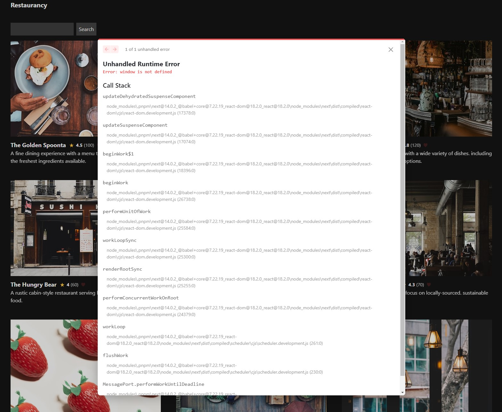

### Pre-renderizado

En Next.js, todos los componentes son pre-renderizados en el servidor por defecto. Esto significa que un componente (aunque sea un Client Component) se ejecutará en el servidor y luego en el cliente. Esto nos permite generar una previsualización (no interactiva) mientras el JavaScript se descarga del lado del cliente. Una vez que esto sucede, nuestra aplicación se hidrata y se vuelve interactiva.

Sin embargo, al ejecutarse en el servidor, no tenemos acceso a `window`. Por eso, debemos asegurarnos de que nuestro componente se renderice solo en el cliente.

### Lazy Loading

En Next.js, podemos usar la función `dynamic` importada desde [`next/dynamic`](https://nextjs.org/docs/app/building-your-application/optimizing/lazy-loading#nextdynamic) para realizar lazy loading de nuestros componentes. Esto nos permite importar un componente de manera dinámica, solo cuando sea necesario. También nos permite definir si un componente debería o no ser renderizado en el servidor mediante la propiedad `ssr`.

Hemos actualizado el código de nuestro componente `RestaurantCard` para que contenga dos componentes: uno para la información y otro para el botón de favorito. El componente de información se pre-renderizará en el servidor y el componente de favorito se renderizará solo en el cliente mediante `dynamic`.

```tsx
'use client'

import dynamic from "next/dynamic";
import Link from "next/link";

function FavoriteButton({restaurant}: {
  restaurant: {
    id: string;
    name: string;
    image: string;
    description: string;
    score: number;
    ratings: number;
  }
}) {
  const isFavourite = window.localStorage.getItem('favorites')?.includes(restaurant.id)

  return (
    <button type="button" className={`text-red-500 text-xl ${isFavourite ? 'opacity-100' : 'opacity-20'}`}>♥</button>
  )
}

// Creamos un componente dinámico para que no se renderice en el servidor
const DynamicFavoriteButton = dynamic(async () => FavoriteButton, { ssr: false });

export default function RestaurantCard({ restaurant }: { restaurant: {
  id: string;
  name: string;
  image: string;
  description: string;
  score: number;
  ratings: number;
}}) {
  return (
    <article>
      
      <h2 className="inline-flex gap-2 text-lg font-bold items-center">
        <Link href={`/${restaurant.id}`}>
          <span>{restaurant.name}</span>
        </Link>
        <small className="inline-flex gap-1">
          <span>⭐</span>
          <span>{restaurant.score}</span>
          <span className="font-normal opacity-75">({restaurant.ratings})</span>
        </small>
        <DynamicFavoriteButton restaurant={restaurant} />
      </h2>
      <p className="opacity-90">{restaurant.description}</p>
    </article>
  );
}
```

Si actualizamos manualmente la clave `favorites` en `localStorage` para incluir el ID de alguno de nuestros restaurantes, deberíamos verlo correctamente.

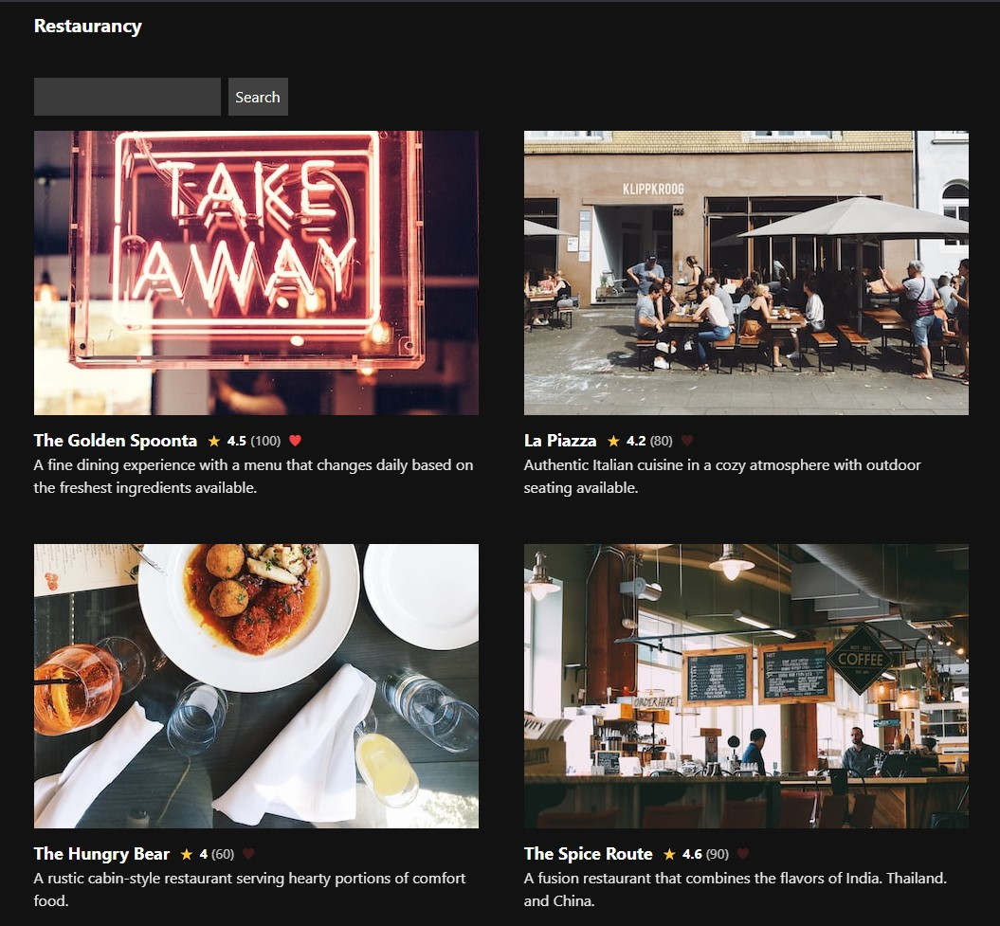

Te dejo algunas tareas:

- Nuestro componente `RestaurantCard` contiene dos componentes. El componente que contiene la información no necesita ninguna actividad, por ende, podría seguir siendo un Server Component. Mueve el componente del botón de favorito a otro archivo e impórtalo.
    - Puedes convertir `RestaurantCard` en una carpeta y agregarle un `index.tsx` y un `FavoriteButton.tsx` dentro. De esa manera, los componentes seguirían colocados lo más cerca de donde son relevantes posible. Pero maneja esto a tu gusto.
- Implementa la funcionalidad de agregar y quitar favoritos en el botón de favorito. Al cargar la página, debería mostrar el estado actual, y al hacer clic en el botón, debería mostrar el estado actualizado y persistir ese estado al recargar la página.
- Estamos repitiendo los tipos para `Restaurant` muchas veces, mueve la interfaz a un archivo `src/types.ts`, exportala y usala donde sea necesario.

## El futuro de Next.js

Lo que vimos a lo largo de este curso es todo lo que se encuentra en la versión estable de Next.js a la versión 15.0.1, pero el futuro de Next.js está lleno de cambios interesantes. Si bien esto que vamos a ver ahora no es estable, está bueno saberlo para estar preparado para lo que viene.

### Dynamic IO

Como te habrás dado cuenta, el caché y sus configuraciones, cuando las cosas son estáticas, cuando no, como hacer determinadas cosas hace que algo que era estático ahora sea dinámico, es confuso. Dynamic IO es un flag experimental que nos permite que las operaciones de obtención de datos en Next.js sean dinámicas a menos que se especifique lo contrario de manera explícita.

Para habilitarlo vamos a modificar nuestro `next.config.ts` para agregar el flag `dynamicIO` dentro de `experimental`:

```ts
import type { NextConfig } from 'next'
 
const nextConfig: NextConfig = {
  experimental: {
    ...
    dynamicIO: true,
  },
  ...
}
 
export default nextConfig
```

Cuando Dynamic IO esté habilitado, vamos a ver que cada vez que intentemos acceder a una página que pueda ser dinámica (que acceda a params, searchParams, headers, tenga un fetch, etc.) vamos a ver un error como este:

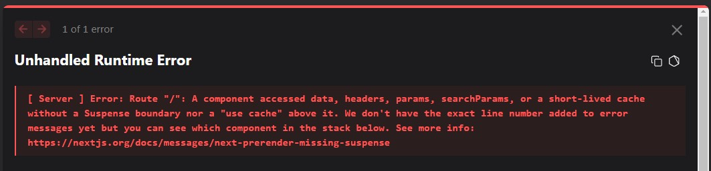

Eso es porque debemos ser explícitos sobre como queremos que nuestra ruta, componente o función se renderice.

Si queremos que una parte de nuestra ruta sea dinámica, vamos a envolver lo que necesitamos que sea dinámico, con un `Suspense`:

```tsx
async function RestaurantContent({id}: {id: string}) {
  const restaurant = await api.fetch(id);
  
  return <div>{restaurant.name}</div>;
}

export default async function RestaurantPage({params}: {params: Promise<{id: string}>}) {
  return (
    <main>
      <header>...</header>
      <Suspense fallback={<div>Loading...</div>}>
        <RestaurantContent id={(await params).id} />
      </Suspense>
      <footer>...</footer>
    </main>
  );
}
```

Ahora si intentamos acceder a esa página, vamos a ver nuestro `header`, `footer` y un `Loading...` donde debería estar el contenido del restaurante, mientras el servidor obtiene los datos.

Si qusieramos que nuestra ruta o partes de ella sean estáticas, vamos a poder usar [`use cache`](https://nextjs.org/docs/canary/app/api-reference/directives/use-cache), [`cacheLife`](https://nextjs.org/docs/canary/app/api-reference/next-config-js/cacheLife) y [`cacheTag`](https://nextjs.org/docs/canary/app/api-reference/functions/cacheTag).

> [!NOTE]
> Al usar `dynamicIO`, no vamos a poder usar configuraciones de segmentos como `dynamic`, `revalidate` y más, vamos a tener otras alternativas para lograr esas funcionalidades.

> [!TIP]
> Hay funciones como `Math.random()`, `Date.now()` que para usarlas debemos usarlas dentro de `use cache` o con [`connection`](https://nextjs.org/docs/app/api-reference/functions/connection) para indicarle a Next.js que debe obtener un nuevo valor en cada petición.

#### `use cache`

Es una directiva que define si un componente, función o archivo debería ser cacheado. Su uso es similar al de `use server`, podemos usarlo dentro de una función o componente para marcarlo como cacheable o podemos definirlo en la parte superior de un archivo para indicar que todas las funciones de ese archivo deberían ser cacheadas.

> [!NOTE]
> Esta directiva es una funcionalidad de Next.js, no como `use client` o `use server`, que son directivas de React.

Por ejemplo, podríamos definir nuestro método `api.list` como cacheable así todos los métodos que lo usan siempre traerían los datos actualizados:

```ts
const api = {
  ...
  list: async (): Promise<Restaurant[]> => {
    // Definimos la función como cacheable
    "use cache";

    // Obtenemos la información de Google Sheets en formato texto y la dividimos por líneas, nos saltamos la primera línea porque es el encabezado
    const [, ...data] = await fetch("...")
      .then((res) => res.text())
      .then((text) => text.split("\n"));

    // Convertimos cada línea en un objeto Restaurant, asegúrate de que los campos no posean `,`
    const restaurants: Restaurant[] = data.map((row) => {
      const [id, name, description, address, score, ratings, image] = row.split(",");

      return {
        id,
        name,
        description,
        address,
        score: Number(score),
        ratings: Number(ratings),
        image,
      };
    });

    // Lo retornamos
    return restaurants;
  },
}
```

> [!TIP]
> Como decíamos antes, podríamos hacer esto en un componente para lograr el mismo resultado.

#### `cacheLife`

Una de las funcionalidades más interesantes del contenido estático es la posibilidad de revalidarlo. En este paradigma de `use cache`, podemos definir un tiempo de vida para ese caché usando la función `cacheLife`.

Imaginemos que queremos que el caché de nuestro listado de restaurantes expire una vez por día:

```ts
import {
  unstable_cacheLife as cacheLife,
} from 'next/cache'

const api = {
  ...
  list: async (): Promise<Restaurant[]> => {
    // Definimos la función como cacheable
    "use cache";

    // Definimos que el caché expire una vez por día
    cacheLife("days");
    ...
  },
}
```

El caché tiene 3 propiedades:

- `stale`: Duración durante la que el cliente puede usar este dato sin tener que preguntarle al servidor si sigue siendo válido.
- `revalidate`: Frecuencia con la que el servidor debería revalidar estos datos. Puede ser que mientras los datos estén siendo revalidados, al usuario se le sirva el dato viejo.
- `expire`: Duración máxima que puede tener el dato, si excede este tiempo se cambiará a renderizado dinámico para asegurarse de mostrar datos actualizados.

Más arriba usamos el perfil `days` para definir que el caché expire una vez por día. En Next.js tenemos varios perfiles por defecto que podemos usar:

| **Perfil**  | **Stale** | **Revalidate** | **Expire**     | **Descripción**                                                                        |
| ----------- | --------- | -------------- | -------------- | -------------------------------------------------------------------------------------- |
| `default`   | undefined | 15 minutos     | INFINITE_CACHE | Perfil por defecto, adecuado para contenido que no necesita actualizaciones frecuentes |
| `seconds`   | undefined | 1 segundo      | 1 minuto       | Para contenido que cambia rápidamente requiriendo actualizaciones en tiempo real       |
| `minutes`   | 5 minutos | 1 minuto       | 1 hora         | Para contenido que se actualiza frecuentemente dentro de una hora                      |
| `hours`     | 5 minutos | 1 hora         | 1 día          | Para contenido que se actualiza diariamente pero puede ser ligeramente desactualizado  |
| `days`      | 5 minutos | 1 día          | 1 semana       | Para contenido que se actualiza diariamente pero puede ser ligeramente desactualizado  |
| `weeks`     | 5 minutos | 1 semana       | 1 mes          | Para contenido que se actualiza mensualmente pero puede ser una semana antigua         |
| `max`       | 5 minutos | 1 mes          | INFINITE_CACHE | Para contenido muy estable que rara vez necesita actualizaciones                       |

Entonces, para nuestro caso de arriba, mientras el usuario esté en la página navegando, cada 5 minutos verificará si el listado de restaurantes sigue siendo válido. Si no lo es, se revalidará en segundo plano y en la siguiente navegación el usuario verá los datos actualizados. Si nadie visitó la web por 1 semana, el primer usuario que acceda, verá la pantalla de carga en vez de los datos desactualizados y se le servirán los datos actualizados.

También podemos definir perfiles personalizados para nuestros datos. Podemos hacerlo en nuestro `next.config.ts`:

```ts
const nextConfig = {
  experimental: {
    dynamicIO: true,
    cacheLife: {
      biweekly: {
        stale: 60 * 60 * 24 * 14, // 14 días
        revalidate: 60 * 60 * 24, // 1 día
        expire: 60 * 60 * 24 * 14, // 14 días
      },
    },
  },
  ...
}
```

Y luego usarlo como `cacheLife("biweekly")`. O podemos hacerlo en linea:

```ts
import {
  unstable_cacheLife as cacheLife,
} from 'next/cache'

const api = {
  ...
  list: async (): Promise<Restaurant[]> => {
    // Definimos la función como cacheable
    "use cache";

    // Definimos que el caché expire una vez por día
    cacheLife({
      stale: 3600, // 1 hora
      revalidate: 900, // 15 minutos
      expire: 86400, // 1 día
    })
    ...
  },
}
```

La directiva de `use cache` con `cacheLife` puede ser anidada y en caso de no ser especificada, los padres más cercanos heredarán su configuración.

#### `cacheTag`

En el paradigma anterior teniamos los `tags` que podíamos definir a nivel `fetch`, ahora tenemos `cacheTag` con la que podemos definir un tag para una función o componente cacheable:

```ts
import {
  unstable_cacheTag as cacheTag,
  unstable_cacheLife as cacheLife,
} from 'next/cache'

const api = {
  ...
  list: async (): Promise<Restaurant[]> => {
    // Definimos la función como cacheable
    "use cache";

    // Definimos que el caché expire una vez por día
    cacheLife("days");
    cacheTag("restaurants")
    ...
  },
}
```

Y al igual que antes, podemos purgar ese caché usando `revalidateTag`.

Una de las ventajas más grandes de esto, es que podemos definir un tag, o listado de tags basado en una respuesta, por ejemplo, si nuestra página de inicio muestra 10 restaurantes, podríamos hacer:

```ts
cacheTag(["1", "2", ...])
```

Y si cambia el restaurante `3` y nosotros hacemos `revalidateTag("3")` solo se va a renderizar la página de inicio si el restaurante `3` estaba presente.

> [!NOTE]
> Actualiza toda la aplicación para usar `dynamicIO` y `use cache`.

---

## Felicitaciones
¡Bien hecho por llegar hasta aquí! 🎉 Planeo mantener este curso actualizado, así que, si te gustó, no dudes en volver en algún momento.

A lo largo de este curso, creamos juntos una pequeña aplicación y exploramos puntos que considero esenciales para desarrollar aplicaciones en Next.js. Pero esto no marca el fin del camino; la verdadera mejora y aprendizaje vienen al poner manos a la obra.

Los martes suelo transmitir en Twitch, donde desarrollo desafíos técnicos reales de empresas en vivo. También hablamos sobre tecnología, respondemos preguntas y más. Si el horario no te sirve, la mayoría de las transmisiones quedan guardadas en mi canal de YouTube.

Si buscas practicar de manera activa, te recomiendo probar algunos de los desafíos que he creado [aquí](https://github.com/goncy/interview-challenges). Y si tienes preguntas que quisieras resolver en comunidad, ¡únete a nuestro [Discord](https://discord.goncy.dev)!

Espero que hayas disfrutado del curso. Si encuentras algo que crees que podría mejorarse o notas algún error, ¡los Pull Requests son bienvenidos! Abajo encontrarás mis redes sociales y los lugares donde puedes hacer donaciones si te gustó mi contenido.

¡Nos vemos! 🚀

---

Si te gusta mi contenido, seguime en [Twitter](https://twitter.gonzalopozzo.com), en [Twitch](https://twitch.gonzalopozzo.com), en [YouTube](https://youtube.gonzalopozzo.com), doname un [Cafecito](https://cafecito.gonzalopozzo.com) o volvete [sponsor en github](https://github.com/sponsors/goncy) ✨
